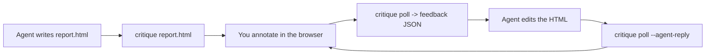

# critique

Render agent-generated HTML, give point-and-click feedback in the browser, and
deliver it back to any coding agent through a simple CLI poll loop.

You review the artifact visually - click an element, select some text, or type a
freeform message - and critique hands each comment (with a stable CSS selector
and the captured text) to whatever agent is doing the work. Annotations are
change requests the agent applies; freeform messages are chat, so you can ask the
agent to explain part of the document without it editing anything. The agent
reports back, and you iterate until it's right.

## How it works



- **You** run `critique <file.html>` and give point-and-click feedback.
- **Your agent** runs `critique poll` to receive it, edits the file, then replies
  and waits for the next round.
- Repeat until the review is done.

The browser panel and the CLI talk to a small local server (loopback, port 4477
by default) that persists session state, so nothing is lost between turns.

## Requirements

- [Bun](https://bun.sh) ≥ 1.1.0

critique runs on Bun — it uses Bun's HTTP server and file APIs at runtime. Node is not supported.

## Install

**Global install (recommended):**

```sh
bun add -g @miketdonahue/critique
critique report.html
```

**One-off with bunx:**

```sh
bunx @miketdonahue/critique report.html
```

**From source:**

```sh
git clone https://github.com/miketdonahue/critique.git && cd critique
bun install
bun run build
bun link        # puts `critique` on your PATH
```

## What an end user should do (the effective workflow)

The whole point is a tight visual feedback loop with your coding agent. Do this:

1. **Have your agent produce the artifact.** Ask your coding agent (Claude Code,
   Cursor, Copilot, aider, …) to generate or edit an HTML file — a report,
   mockup, dashboard, email, etc.

2. **Open it for review:**
   ```sh
   critique report.html
   ```
   A browser tab opens with your artifact on the left and a review panel on the
   right. (Re-running the same command later resumes the same session.)

3. **Give point-and-click feedback.** In the browser:
   - Toggle **Annotate** mode (top-right settings menu, or `⌘I` / `Ctrl+I`).
   - **Click any element** or **select text** to open a note card, type what you
     want changed, and submit. It appears under **Requested changes** with the
     element/text it's anchored to.
   - Type a **freeform message** in the chat box and click **Submit** to ask a
     question or discuss the document (the agent answers without editing), or to
     request a change that isn't tied to one spot.
   - When you've queued everything for this round, click **Request changes (N)**.

4. **Point your agent at the loop.** Tell your agent to run `critique instructions`
   (the authoritative, always-current contract) — or, if your harness reads them,
   the bundled `AGENTS.md` / `SKILL.md` describe it. In short, the agent will:
   ```sh
   critique poll report.html --timeout-ms 60000            # receive your feedback
   # ...edit report.html to address each item...
   critique poll report.html --agent-reply "what I changed" --timeout-ms 60000
   ```
   The artifact live-reloads in your browser as the agent revises it, and each
   agent reply shows up on the matching review card.

5. **Iterate.** Keep annotating and clicking **Request changes**; the agent keeps
   polling, editing, and replying. When you're satisfied, end the review (settings
   menu → **End review**, or the agent runs `critique end report.html`).

### Tips for effective reviews

- **One concern per annotation.** Small, specific notes anchored to an element
  give the agent an exact selector to act on.
- **Batch a round, then submit.** Queue several related changes and send them
  together with **Request changes** so the agent addresses them as one unit.
- **Use the chat box for questions and global asks.** Ask the agent to explain
  part of the document (it replies without editing), or request a change that
  doesn't belong to a single element.
- **You don't have to wait at the keyboard.** Feedback is stored server-side; the
  agent's `poll` picks it up whenever you submit, even minutes later.

## Using it with your coding agent

critique is agent-agnostic — it's just a CLI with human-readable output and an
embedded machine-readable JSON payload. The integration contract lives with the
binary and can't drift from the code:

```sh
critique instructions
```

Run that once and paste it into your agent, or reference the bundled files:

- **`AGENTS.md`** — portable, tool-neutral instructions (read by Cursor, Zed,
  aider, and others).
- **`SKILL.md`** — the same loop as a skill-format wrapper for Claude/omp-style
  harnesses.

**Interactive agents: always poll with a bounded `--timeout-ms` and re-poll.** A
naked `critique poll` can wait up to ~240s per call and stall the harness; the
bounded pattern returns control and loses nothing (feedback is durable
server-side).

## CLI reference

```
critique <file.html>            Open (or resume) a review session in the browser.
critique poll <file.html>       Wait for feedback, then print it. Re-run each turn.
critique end <file.html>        End the session (agent-initiated).
critique stop                   Shut down the background server.
critique server                 Run the server in the foreground.
critique instructions           Print the agent integration contract.
```

Flags:

```
--no-open              Ensure the session exists without opening a browser window.
--agent-reply "<text>" (poll) Post the agent's reply to the browser, then keep polling.
--timeout-ms <ms>      (poll) Return control after <ms> if no feedback arrives.
```

Environment:

```
CRITIQUE_PORT (default 4477)   Port the local server listens on.
CRITIQUE_HOST                  Interface to bind (loopback by default).
CRITIQUE_STATE_DIR             Where session state + the server log live (~/.critique).
CRITIQUE_NO_OPEN=1             Never auto-open a browser.
```

## Development

```sh
bun run build       # build dist/chrome (React UI) and dist/sdk (injected SDK)
bun run build:chrome
bun run build:sdk
bun run typecheck   # tsc --noEmit
bun run dev <file>  # run the CLI from source
bun run server      # run the server in the foreground
```

The browser chrome is a React + Tailwind + shadcn/ui app under `src/chrome`. The
injected annotation SDK (`src/sdk`) stays vanilla — it runs inside arbitrary
agent-generated artifacts and renders in a Shadow DOM for isolation.
